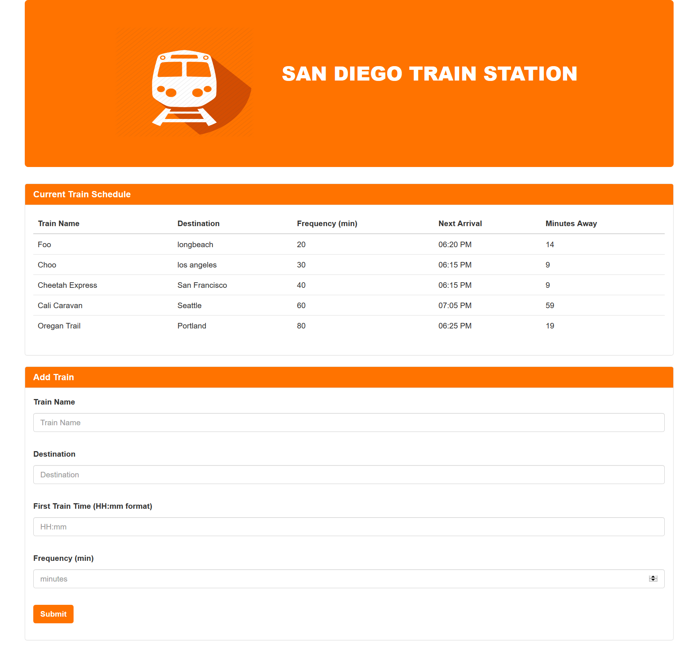

# Train-Scheduler
- Train scheduler application that incorporates Firebase to host arrival and departure data.
- The app will retrieve and manipulate this information with Moment.js.
- This website will provide up-to-date information about various trains, namely their arrival times and how many minutes remain until they arrive at their station.
- When adding trains, administrators should be able to submit the following:
1) Train Name
2) Destination
3) First Train Time -- in military time
4) Frequency -- in minutes
5) The app is coded to calculate, when the next train will arrive(this should be relative to the current time)
6) Users from many different machines must be able to view same train times.

